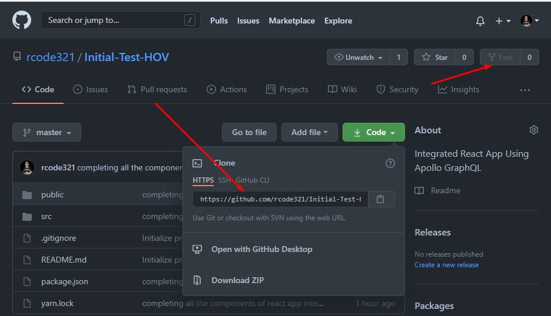
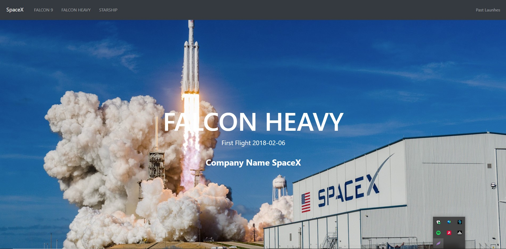

# SpaceX API - PROJECT


## Description

This is a React App using Apollo GraphQL Test integrated app using 3rd party public GraphQL API using  [**SpaceX**](https://api.spacex.land/graphql/) In it, you'll find all of the SpaceX missions and a lot of different fields to query. For example, you could send a query for past launches:


> React Dependencies i use/ **NPM** are 
* **AOS**- for animating images and tables content.
* **react-router-bootstrap** - navigating the links, but i decided to use react-router-dom built in **{Links}** 😅
* **react-player** - for hero videos in home component. 📹
* **react-bootstrap** - styling the navbar also for responsiveness.
* **GraphQL / Apollo Client/Apollo Boost** - Fetch Data / Integrate and Display Data Being fetched/Query and styling it.

### Tech Stack

```
 - React.js
 - Scss / CSS
 - Bootstrap

 Communication Tool:

 - GraphQL
 - Apollo Client

```
>**INSTALLATION** fork the repo and clone it in your local machine using your terminal or gitbash command line.



> **Yarn** / Npm Install to install some dependencies and node modules. 
> **yarn start** | npm start

  > **Runs the app in the development mode.**
  Open [http://localhost:3000](http://localhost:3000) to view in the browser.
## Project Screenshot | GIF
  


  ## Thank You for checking the project 🙂😊
  Happy Coding Everyone 💻 